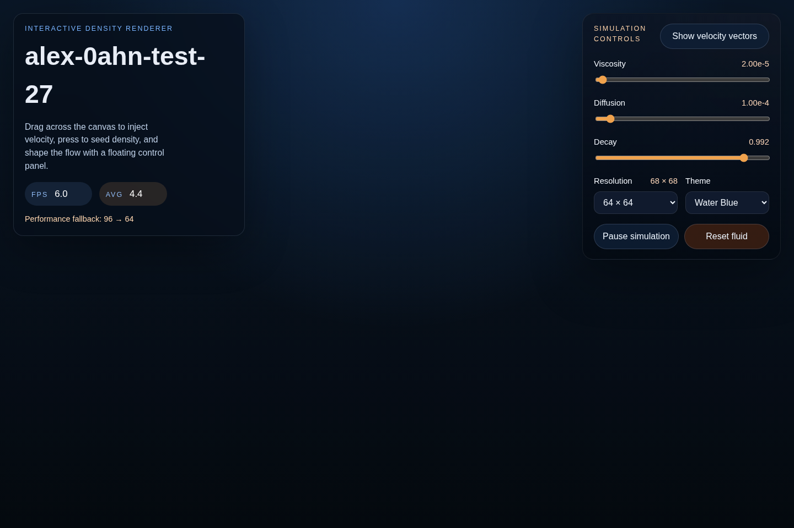

# alex-0ahn-test-27

Interactive fluid playground built with Vite and TypeScript. The app renders a density field to a full-screen canvas, supports mouse or touch input for stirring the flow, and exposes a floating control panel for tuning the simulation in real time.



## What You Can Do

- Drag across the canvas to inject density and push the velocity field.
- Toggle the velocity-vector overlay for debugging or teaching demos.
- Tune viscosity, diffusion, and decay from the control panel.
- Switch the requested simulation resolution without reloading the page.
- Change the render theme between the default water-blue palette and amber-heat.
- Pause, resume, or reset the simulation at any time.
- Let the app automatically step the resolution down if sustained low FPS is detected.

## Parameters

- `Viscosity`: Increases velocity smoothing. Higher values make swirls slow down and spread more heavily.
- `Diffusion`: Increases density spreading. Higher values make injected color bloom faster across the field.
- `Decay`: Controls how quickly density and velocity fade over time. Values closer to `1.0` linger longer.
- `Resolution`: Chooses the requested simulation grid size before responsive scaling is applied to the current viewport.
- `Theme`: Switches the density-color palette.
- `Pause simulation`: Freezes stepping while keeping the current frame visible.
- `Reset fluid`: Rebuilds the simulation and clears the active field.

## Requirements

- Node.js 20+
- pnpm 10+

## Local Development

Install dependencies:

```bash
pnpm install
```

Run the development server:

```bash
pnpm dev --host 0.0.0.0 --port 8080
```

Quality checks:

```bash
pnpm lint
pnpm format
pnpm test:unit
pnpm test:e2e
```

## Production Build

Create the production bundle:

```bash
pnpm build
```

Observed output from the validated build:

- `dist/` total size: `44K`
- `dist/assets/index-BYm9Wa_P.js`: `27.68 kB` raw, `7.46 kB` gzip
- `dist/assets/index-zyr5K62p.css`: `3.47 kB` raw, `1.36 kB` gzip
- `dist/index.html`: `1.12 kB` raw, `0.52 kB` gzip

## Preview Validation

Serve the built app locally:

```bash
pnpm preview --host 0.0.0.0 --port 8080
```

Validation notes:

- The production preview loads successfully on the first screen without requiring additional setup.
- The archived screenshot at [docs/preview-home.png](/workspace/docs/preview-home.png) was captured from the `pnpm preview` output served locally.

## Testing

- `pnpm test:unit` runs Vitest in a `jsdom` environment.
- `pnpm test:e2e` runs Playwright Chromium coverage for the critical canvas path:
  page load, drag-to-render change, control-panel render impact, and reset behavior.

## Environment

Copy `.env.example` to `.env.local` to override local settings.
